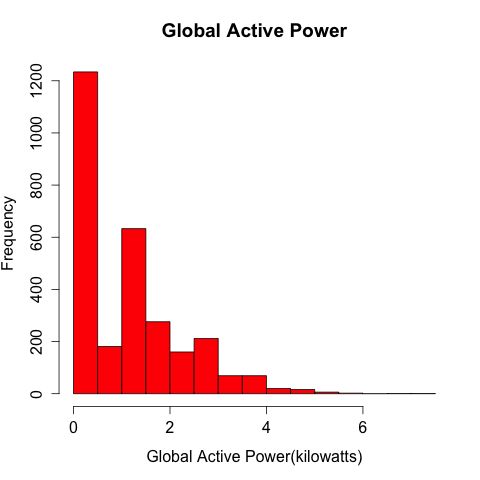
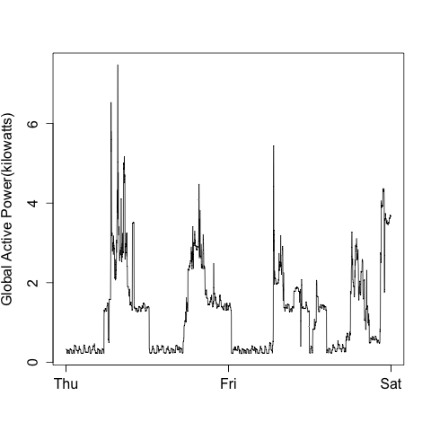
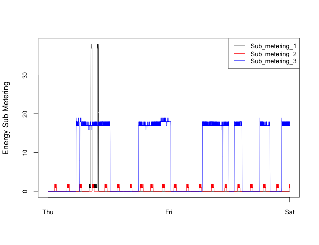
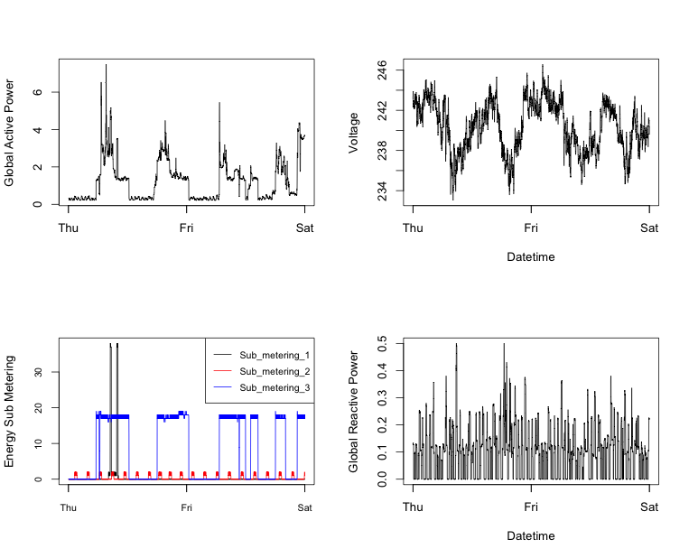

Exploratorary Data Analysis - Project 1
===================

This file shows the output of first Project of Exploratorary Data Analysis - Course

---
### Files Updated in Repository after the initial fork are
This repo includes following files
- `plot1.R` which generates plot 1
- `plot2.R` which generates plot 2
- `plot3.R` which generates plot 3
- `plot4.R` which generates plot 4
- `plots` folder which contains plot1.png, plot2.pnf, plot3.png and plot4.png

---
### Plots Generated as per Project 1

The four plots that are shown below. 

### Plot 1

 

### Plot 2

 

### Plot 3

 

### Plot 4

 

